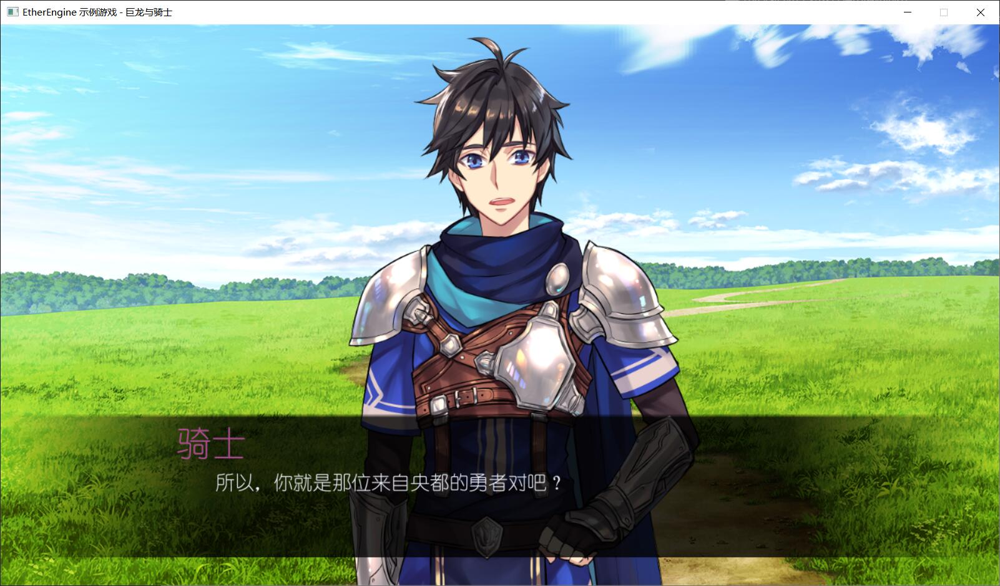

# Dragon-Knight

### 《巨龙与骑士》[EtherEngine](https://github.com/VoidmatrixHeathcliff/EtherEngine) 示例游戏

+ 本项目仅做代码交流使用，所使用的图片和字体文件请勿随意商用

+ 源代码位于 `Script` 文件夹下，同文件夹下的 `ESBuilder.exe` 运行后可将源代码编译为字节码文件

+ 游戏存档位于 `Archive` 文件夹下，删除 `archive.data` 并将文件 `archive - 空白存档.data` 重命名为 `archive.data` 可以重置游戏进程

+ 游戏中展示了 **音乐播放** 、**存档** 、**视觉小说类场景渲染** 、**弹幕射击类游戏**  等功能的实现

+ 游戏代码可能并不与最新版本的 [EtherEngine](https://github.com/VoidmatrixHeathcliff/EtherEngine) 兼容，如需尝试请下载示例源码运行或下载 `Release` 版本运行

## 示例图片

